# Arquitetura — Central de Inteligencia Juridica

## Visao Geral

Plataforma multiagente para automacao de consultas juridicas tribunais brasileiros.

## Componentes Principais

### Agentes

| Agente | Responsabilidade |
|---|---|
| **SupervisorAgent** | Orquestra tarefas, identifica tribunais, delega |
| **TribunalAgent** | Operacoes por tribunal (status, processo, movimentacoes) |
| **ArchitectAgent** | Chain-of-Thought para planejamento |
| **UnifiedOrchestrator** | Orquestracao avancada (endpoint `/api/v1/tasks/advanced`) |
| **IntentClassifier** | Classifica intencao (LLM + fallback heuristico) |

### Infraestrutura

| Componente | Responsabilidade |
|---|---|
| **CacheManager** | Cache com Circuit Breaker (Redis + memoria) |
| **DecisionLedger** | Registro persistente de decisoes |
| **InputSanitizer** | Protecao contra XSS e SQL Injection |
| **VectorMemory** | Memoria vetorial com ChromaDB |

### Consenso e Autonomia

| Componente | Responsabilidade |
|---|---|
| **WeightedConsensusEngine** | Consenso ponderado por expertise |
| **ProgressiveAutonomyManager** | Autonomia progressiva com HITL |
| **HITLQueue** | Fila de aprovacoes em tempo real (WebSocket) |

### Protocolos e Interface

| Componente | Responsabilidade |
|---|---|
| **AgentRegistry (MCP)** | Discovery de capacidades dos agentes (`/api/v1/agents`) |
| **A2AChannel** | Comunicacao agente-a-agente (Redis + fallback in-memory) |
| **SPA (React+Vite)** | Interface web servida pelo FastAPI em `/app` |

### Superfície de API (`/api/v1`)

Tarefas, HITL (`/hitl/*` + WebSocket), treinamento (`/training/*`), agentes/MCP
(`/agents/*`), A2A (`/a2a/*`), auditoria (`/ledger`), autonomia (`/autonomy/config`),
monitoramento (`/monitoring/health`), histórico (`/history`). A especificação
completa é gerada pelo próprio app em `/docs` (Swagger) e `/openapi.json`.

> **Visão C4 detalhada (Contexto → Código) + diagramas de sequência:**
> [`docs/ARCHITECTURE_C4.md`](docs/ARCHITECTURE_C4.md).

## Diagrama de Componentes

```mermaid
graph TB
    subgraph API["API Layer"]
        FastAPI[FastAPI]
    end

    subgraph Agents["Agent Layer"]
        SUP[SupervisorAgent]
        TRIB[TribunalAgent]
        ARCH[ArchitectAgent]
    end

    subgraph Infra["Infrastructure"]
        CACHE[CacheManager]
        LEDGER[DecisionLedger]
        SANIT[InputSanitizer]
        VECMEM[VectorMemory]
    end

    subgraph Consensus["Consensus & HITL"]
        WCE[WeightedConsensus]
        PAM[ProgressiveAutonomy]
    end

    subgraph External["External Services"]
        REDIS[(Redis)]
        CHROMA[(ChromaDB)]
        PROM[(Prometheus)]
    end

    FastAPI --> SANIT
    FastAPI --> SUP
    SUP --> TRIB
    SUP --> ARCH
    SUP --> WCE
    SUP --> PAM
    SUP --> LEDGER
    TRIB --> CACHE
    TRIB --> VECMEM
    CACHE --> REDIS
    VECMEM --> CHROMA
```



---

## Onda 1 — Camada de Integrações Jurídicas

### Fontes de Dados

| Fonte | Tipo | Zone | Modo |
|-------|------|------|------|
| CNJ DataJud | processo_por_numero | publica | real |
| DJEN/Comunica PJe | publicacao_dje | publica | real |
| Receita Federal/BrasilAPI | cadastro_empresa | publica | real |
| TSE Dados Abertos | eleitoral | publica | real |
| CRC/CENPROT (protestos) | protesto | restrita | mock* |
| Cadin | cadin | restrita | mock* |
| ONR/SREI (imóveis) | imovel | restrita | mock* |

*Troca mock→real = somente variável de ambiente `INTEGRATIONS_{SOURCE}_MODE=real`

### Fluxo

```
GraphQL POST /api/v1/intelligence/graphql (JWT + permission intelligence:query)
  └─ IntelligenceOrchestrator.investigate(identifier, ...)
       1. classify_identifier()  → CPF/CNPJ/OAB/nº CNJ/nome
       2. seleção de adaptadores pelo identifier_type e zona
       3. DataSourcePolicy.assert_source() (hard block CJ-001)
       4. execução paralela → AdapterResult por fonte
       4b. expand_qsa → RelatedPartyFinding por sócio
       5. RiskEngine → score 0-100 + dimensões + recomendações
       6. DecisionLedger (identifier_hash sha256)
       7. score ≥ 70 → HITL gate
  └─ ConsolidatedReport → GraphQL response
```

### Expansão QSA

Quando `expand_qsa=true` e fonte `receita_cnpj` retorna com sucesso:
- Sócio PF → consulta DJEN/TSE por nome (`homonimo_possivel=true`)
- Sócio PJ → consulta receita_cnpj pelo CNPJ do sócio
- Limite: `INTEGRATIONS_QSA_MAX_SOCIOS` (padrão 5), depth=1

### Risk Score Multidimensional

Dimensões: **jurídico** / **fiscal** / **patrimonial** / **societário**
Score total 0-100, gate HITL em ≥70.

### Agentes de Inteligência

- **IntelligenceAgent**: due diligence 360°, delegável pelo Supervisor
- **FiscalAgent**: perfil fiscal (receita_cnpj + cadin + crc_protestos), gera proposta de consenso na dimensão fiscal

---

## Onda 2 — Preparação Arquitetural (não implementada)

### SPED Completo

- `SpedAdapter` consumirá regularidade ECD/ECF/EFD + metadados
- Certificado digital A1/A3 no vault (CredentialProvider)
- Cross-check CPC 25: provisões ECD × execuções fiscais DataJud
- data_type: `sped_regularidade` (zone: `credenciada`) já no governance YAML

### Fontes Credenciadas

- CRC/Cadin/ONR: worker scraping Playwright separado (fila → mesmo contrato de adaptador)
- SERPRO Consulta CNPJ credenciada: substitui BrasilAPI, traz CPF de sócios → expansão QSA exata
- ProJuris/Escavador: `oauth2_base.py` (skeleton pronto)

### Credenciais Multi-tenant

```python
CredentialProvider.get_credentials(source, tenant_id=None)
# Onda 1: EnvCredentialProvider (INTEGRATIONS_{SOURCE}_API_KEY)
# Onda 2: VaultCredentialProvider (HashiCorp/AWS Secrets Manager)
```
