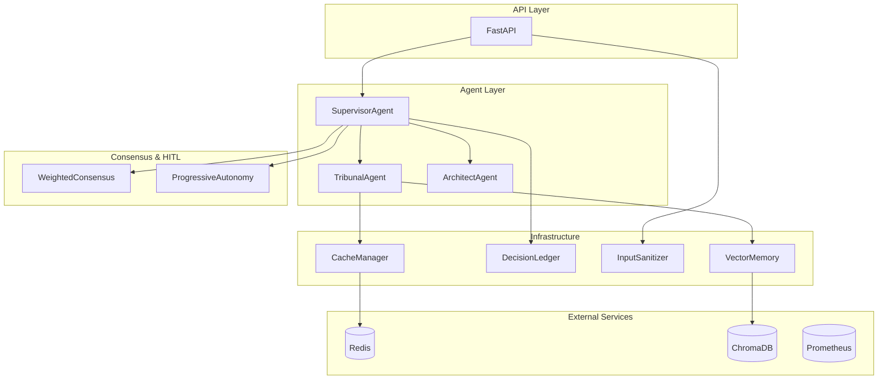

# Arquitetura — Central de Inteligencia Juridica

## Visao Geral

Plataforma multiagente para automacao de consultas juridicas tribunais brasileiros.

## Componentes Principais

### Agentes

| Agente | Responsabilidade |
|---|---|
| **SupervisorAgent** | Orquestra tarefas, identifica tribunais, delega |
| **TribunalAgent** | Operacoes por tribunal (status, processo, movimentacoes) |
| **ArchitectAgent** | Chain-of-Thought para planejamento |
| **UnifiedOrchestrator** | Orquestracao avancada (endpoint `/api/v1/tasks/advanced`) |
| **IntentClassifier** | Classifica intencao (LLM + fallback heuristico) |

### Infraestrutura

| Componente | Responsabilidade |
|---|---|
| **CacheManager** | Cache com Circuit Breaker (Redis + memoria) |
| **DecisionLedger** | Registro persistente de decisoes |
| **InputSanitizer** | Protecao contra XSS e SQL Injection |
| **VectorMemory** | Memoria vetorial com ChromaDB |

### Consenso e Autonomia

| Componente | Responsabilidade |
|---|---|
| **WeightedConsensusEngine** | Consenso ponderado por expertise |
| **ProgressiveAutonomyManager** | Autonomia progressiva com HITL |
| **HITLQueue** | Fila de aprovacoes em tempo real (WebSocket) |

### Protocolos e Interface

| Componente | Responsabilidade |
|---|---|
| **AgentRegistry (MCP)** | Discovery de capacidades dos agentes (`/api/v1/agents`) |
| **A2AChannel** | Comunicacao agente-a-agente (Redis + fallback in-memory) |
| **SPA (React+Vite)** | Interface web servida pelo FastAPI em `/app` |

### Superfície de API (`/api/v1`)

Tarefas, HITL (`/hitl/*` + WebSocket), treinamento (`/training/*`), agentes/MCP
(`/agents/*`), A2A (`/a2a/*`), auditoria (`/ledger`), autonomia (`/autonomy/config`),
monitoramento (`/monitoring/health`), histórico (`/history`). A especificação
completa é gerada pelo próprio app em `/docs` (Swagger) e `/openapi.json`.

> **Visão C4 detalhada (Contexto → Código) + diagramas de sequência:**
> [`docs/ARCHITECTURE_C4.md`](docs/ARCHITECTURE_C4.md).

## Diagrama de Componentes

