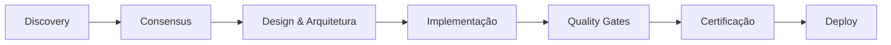

# 📘 BuildToFlip v6 — Documentação Oficial Completa (Versão Final)
_Incorporando todos os ajustes de conformidade com Crisp Pragmatist v2→v5→v6_

## 📌 Índice
1. [Visão Geral](#-visão-geral)
2. [Filosofia e Princípios](#-filosofia-e-princípios)
3. [Squad de IAs](#-squad-de-ias)
4. [Estrutura do Projeto](#-estrutura-do-projeto)
5. [Discovery & Consensus](#-discovery--consensus)
6. [Quality Gates](#-quality-gates)
7. [Arquitetura de Referência](#-arquitetura-de-referência)
8. [UI/UX Kit](#-uiux-kit)
9. [Infraestrutura e DevOps](#-infraestrutura-e-devops)
10. [Governança e ADRs](#-governança-e-adrs)
11. [Guia de Implementação](#-guia-de-implementação)
12. [Checklists Obrigatórios](#-checklists-obrigatórios)
13. [Scripts e Automação](#-scripts-e-automação)
14. [Templates e Starter Kit](#-templates-e-starter-kit)
15. [Roadmap e Evolução](#-roadmap-e-evolução)
16. [Certificação BuildToFlip v6](#-certificação-buildtoflip-v6)
17. [Anexos e Referências](#-anexos-e-referências)

---

## 📎 Visão Geral
BuildToFlip v6 é uma metodologia de desenvolvimento Full-Stack que combina:

- Orquestração por IAs especializadas (Arquiteto, Dev, Auditor, Designer, Ops)
- Filosofia Crisp Pragmatist: disciplina mínima, valor máximo
- Vendabilidade desde o MVP: produto sempre demonstrável
- Quality Gates rigorosos: UI/UX, performance, segurança, infra
- Governança transparente: ADRs, consenso versionado, fallback humano

### ⚡ Evolução da v5 para v6
A v6 mantém integralmente tudo da v5 e adiciona:

- UI/UX completo: IA-Designer, mockups, acessibilidade
- Infraestrutura pronta: Terraform, Ansible, Docker Compose com observabilidade
- Testes expandidos: k6 obrigatório, OWASP scan, Lighthouse
- Governança aprofundada: ADR template, certificados, vendor readiness

> 💡 Retrocompatibilidade total: projetos v5 migram para v6 sem perdas.

---

## 🎯 Filosofia e Princípios
**Mandamentos Crisp Pragmatist**

1. Explícito > Mágico: código óbvio sobre "framework magic".
2. Erros em RFC 7807: ProblemDetail com traceId e instance.
3. Testes por camada: unitário + integração + performance para cada must_have.
4. Observabilidade mínima: healthcheck + logs estruturados + métricas.
5. Setup < 5 minutos: projeto rodando com um comando.
6. Injeção por construtor: `@Autowired` em campos é proibido.
7. Commits convencionais: feat/fix/docs com escopo claro.
8. Performance pragmática: MVP com P95 < 800ms.
9. Decisões documentadas: toda escolha não óbvia em ADR.
10. Produto sempre vendável: desde o MVP até enterprise.
11. ✅ Nada Fake: qualquer mock/dado sintético deve ser marcado explicitamente (README, UI e logs com `X-BTF-Mock: true`).

---

## 🤖 Squad de IAs
| Agente | Responsabilidade | Artefatos Principais |
|--------|-------------------|----------------------|
| IA-Arquiteto | Discovery, decisões técnicas, ADRs | `.buildtoflip/consensus/discovery-consensus.v6.json`, ADRs |
| IA-Dev | Implementação, testes, código | `src/`, `tests/`, `docs/API/openapi.yaml` |
| IA-Auditor | Quality gates, segurança, compliance | `scripts/gates-v6.sh`, certificados |
| IA-Designer | UI/UX, acessibilidade, mockups | `docs/UX/ui-kit.md`, `docs/UX/mockups/README.md` |
| IA-Ops | Infra, CI/CD, observabilidade | `terraform/`, `docker/`, `.github/`
| Prompt Engineer | Orquestração, alinhamento, consenso | `handoff-codex.md`

### 🔄 Fluxo de Trabalho


---

## 📂 Estrutura do Projeto
```
.
├── .buildtoflip/
│   ├── consensus/
│   │   ├── discovery-consensus.v6.json
│   │   └── decision-tree-pro.v6.json
│   ├── responses/
│   ├── validations/
│   └── ledger/
├── docs/
│   ├── API/
│   ├── UX/
│   └── ADR/
├── src/
│   ├── main/
│   └── test/
├── terraform/
├── ansible/
├── docker/
├── k6/
├── scripts/
├── .github/
├── .env.example
├── .env.dev
├── .env.prod
├── handoff-codex.md
├── buildtoflip-v6-certificate.md
└── README.md
```

---

## 🔍 Discovery & Consensus
**Regra de Consenso (Fast Consensus)**

- Modelo: maioria simples entre as IAs votantes (Architect, Dev, Auditor, Designer, Ops).
- Empate: decide IA-Arquiteto; se persistir, aciona fallback humano (Prompt Engineer).
- Registro: salvar decisão em `.buildtoflip/consensus/*` e racional em `.buildtoflip/ledger/decisions.log`.

### discovery-consensus.v6.json (estrutura)
```json
{
  "version": "6.0",
  "timestamp": "2025-01-XX",
  "project": {
    "name": "project-name",
    "domain": "fintech|healthtech|saas|erp",
    "buyer": "startup|enterprise",
    "timeline": "2-3 semanas MVP",
    "budget_range": "low|medium|high"
  },
  "problem": {
    "statement": "Descrição clara do problema",
    "current_pain": "Dor atual do cliente",
    "desired_outcome": "Estado futuro desejado"
  },
  "must_have": ["Feature essencial 1", "Feature essencial 2", "Feature essencial 3"],
  "nice_to_have": ["Feature desejável 1", "Feature desejável 2"],
  "explicitly_excluded": ["Fora do escopo 1", "Fora do escopo 2"],
  "constraints": ["Stack obrigatória", "Compliance específica", "Performance mínima"],
  "success_metrics": {
    "technical": ["P95 < 800ms", "Uptime > 99.9%"],
    "business": ["ROI em 6 meses", "10 clientes em 30 dias"]
  }
}
```

### decision-tree-pro.v6.json (estrutura)
```json
{
  "version": "6.0",
  "timestamp": "2025-01-XX",
  "foundation_level": "lite|standard|enterprise",
  "votes": {
    "architect": {"level": "lite", "confidence": 0.9},
    "developer": {"level": "lite", "confidence": 0.85},
    "auditor": {"level": "standard", "confidence": 0.75},
    "designer": {"level": "lite", "confidence": 0.8},
    "ops": {"level": "standard", "confidence": 0.7}
  },
  "consensus": {
    "level": "lite",
    "reasoning": "MVP rápido com vendabilidade",
    "method": "fast-consensus-majority",
    "upgrade_triggers": [
      "Volume > 1000 req/s",
      "Compliance regulatória",
      "Multi-tenant obrigatório"
    ]
  },
  "implementation_profile": {
    "lite": {
      "stack": ["Spring Boot", "Postgres", "Docker"],
      "infra": ["Single server", "Basic monitoring"],
      "timeline": "2-3 semanas"
    },
    "standard": {
      "stack": ["+ Redis", "+ Kafka", "+ OAuth2"],
      "infra": ["Load balancer", "Auto-scaling", "Full observability"],
      "timeline": "6-8 semanas"
    },
    "enterprise": {
      "stack": ["+ Multi-region", "+ Event sourcing", "+ CQRS"],
      "infra": ["Kubernetes", "Service mesh", "DR setup"],
      "timeline": "3-6 meses"
    }
  }
}
```

---

## 🤖 Modo Agente de IA

Quando `project_type: "ai_agent"` é definido no `discovery-consensus.v6.json`, o projeto habilita capacidades agênticas especializadas.

### Quando ativar o modo agente
- Produto exige autonomia contínua, raciocínio multi-etapas ou integração com ferramentas externas críticas.
- Há necessidade de monitoramento ativo das trajetórias com métricas técnicas e de negócio.
- Requer coordenação com múltiplos subsistemas (APIs, vector DB, humanos no loop) com fallback definido.

### Quando manter o fluxo tradicional
- Escopo é linear, com sequência fixa de prompts e sem dependência de contexto persistente.
- O objetivo é responder a consultas ou gerar conteúdo estático sem observabilidade contínua.
- O custo de orquestrar memória, avaliação contínua e ferramentas supera o valor incremental esperado.

### Capacidades Ativadas
- **Famílias de Padrões**: Execução, Raciocínio, Memória, Colaboração, Resiliência
- **Orquestração Automática**: Matriz de interoperabilidade entre padrões
- **Fallback Progressivo**: Degradação graceful com 3 níveis
- **Observabilidade Nativa**: Trajetórias de raciocínio auditáveis

### Fluxo de Trabalho Específico
1. `scripts/agent-lifecycle/bootstrap-agent.sh` - Inicializa com capacidades mínimas
2. `scripts/agent-lifecycle/evolve-capabilities.sh` - Adiciona padrões incrementalmente
3. `scripts/agent-lifecycle/validate-behavior.sh` - Valida contra especificação

---

## ✅ Quality Gates
| Categoria | Gate | Critério MVP | Critério Production |
|-----------|------|--------------|---------------------|
| UI/UX | Lighthouse Performance | ≥ 80 | ≥ 90 |
| UI/UX | Lighthouse Accessibility | ≥ 80 | ≥ 95 |
| Testes | Cobertura unitária | ≥ 60% | ≥ 80% |
| Testes | Testes por must_have | 1 positivo + 1 negativo | Completo |
| Performance | P95 latência | < 800ms | < 500ms |
| Performance | Throughput | 100 req/s | 1000 req/s |
| Segurança | OWASP vulnerabilities | Critical: 0 | High/Medium: 0 |
| Segurança | Secrets scan | Nenhum | Nenhum |
| Infra | Deploy time | < 10 min | < 5 min |
| Infra | Rollback time | < 5 min | < 2 min |
| Código | RFC 7807 errors | Implementado | Completo |
| Código | Healthcheck | Básico | Detalhado |
| Observability | Logs estruturados | JSON | ELK/Loki |
| Observability | Métricas | Prometheus + custom | Prometheus + custom |
| Docs | OpenAPI | Presente | Completo + exemplos |
| Docs | README setup | < 5 min | < 3 min |

**Regra mínima de testes por must_have:** 1 cenário positivo e 1 negativo por requisito essencial.

---

## 🏗 Arquitetura de Referência
```
┌─────────────────────────────────────────┐
│           Presentation Layer            │
│         (Controllers, DTOs)             │
├─────────────────────────────────────────┤
│           Application Layer             │
│         (Use Cases, Services)           │
├─────────────────────────────────────────┤
│            Domain Layer                 │
│      (Entities, Value Objects)          │
├─────────────────────────────────────────┤
│         Infrastructure Layer            │
│    (Repositories, External APIs)        │
└─────────────────────────────────────────┘
```

**Estrutura de pacotes (Java/Spring)**
```
br.com.company.project/
├── adapter/
│   ├── in/
│   │   └── web/
│   └── out/
│       ├── persistence/
│       └── integration/
├── core/
│   ├── domain/
│   └── service/
├── config/
└── exception/
```

**Erros RFC 7807:** `Content-Type: application/problem+json` com campos `type`, `title`, `status`, `detail`, `instance`, `traceId`.

---

## 🎨 UI/UX Kit
Consulte `docs/UX/ui-kit.md` e `docs/UX/mockups/README.md` para componentes, tokens e referências aos protótipos hospedados externamente.

**Checklist de Acessibilidade:** contraste, foco visível, labels claros, ARIA, navegação por teclado, skip links e mensagens de erro vinculadas.

---

## 🚀 Infraestrutura e DevOps
**Endpoints Operacionais**
- Health: `GET /actuator/health`
- Info: `GET /actuator/info`
- Métricas Prometheus: `GET /actuator/prometheus`
- Readiness: `GET /actuator/health/readiness`
- Liveness: `GET /actuator/health/liveness`

**Logs Estruturados (JSON)**
```json
{
  "timestamp": "2025-09-25T12:45:00Z",
  "level": "INFO",
  "service": "nfe-processor",
  "env": "prod",
  "traceId": "8f0c1234-5678-90ab-cdef",
  "spanId": "abcd1234",
  "message": "NFe upload concluded",
  "docId": "NFe35220812345678000123550010000000011"
}
```

**docker-compose-prod.yml** disponível em `docker/docker-compose-prod.yml` com app, Postgres, Redis, Prometheus e Grafana.

**Terraform** configura VPC, ECS, RDS e Monitoring com módulos reutilizáveis (`terraform/main.tf`).

**Pipeline CI/CD** (`.github/workflows/buildtoflip-v6.yml`) executa testes, cobertura, OWASP, k6, Lighthouse e valida quality gates antes de buildar e fazer deploy.

---

## 📑 Governança e ADRs
- Ledger & Overrides: `.buildtoflip/ledger/decisions.log` e `.buildtoflip/ledger/overrides.log` (append-only).
- Template ADR: `docs/ADR/ADR-Template.md`.
- Exemplos: `docs/ADR/001-performance-target.md`, `docs/ADR/002-database-choice.md`.

**Exemplo de override**
```json
{"timestamp":"2025-09-25T12:03:11Z","actor":"IA-Auditor","type":"gate_override","gate":"Lighthouse","reason":"Ambiente sem headless chrome no CI","mitigation":"rodar local e anexar relatório","approved_by":"Prompt Engineer"}
```

---

## 🛠 Guia de Implementação
**Definition of Ready**
- discovery-consensus.v6.json validado.
- decision-tree-pro.v6.json com nível definido.
- UI Kit aprovado.
- ADRs críticas aceitas.
- `.env.*` configurados.

**Quick Start (< 5 minutos)**
```bash
git clone https://github.com/buildtoflip/template-v6.git my-project
cd my-project
./scripts/init-v6.sh
cp .env.example .env.dev
# editar .env.dev
./scripts/gates-v6.sh
docker-compose up -d
./mvnw spring-boot:run
```
Acesse: `http://localhost:8080` e `http://localhost:3000` (Grafana).

**Comandos Essenciais**
| Comando | Descrição |
|---------|-----------|
| `./scripts/init-v6.sh` | Cria estrutura completa do projeto |
| `./scripts/gates-v6.sh` | Executa todos os quality gates |
| `./scripts/demo-v6.sh` | Sobe demo completa com dados |
| `./scripts/rollback-v6.sh` | Rollback rápido em caso de falha |
| `./mvnw clean verify` | Build + testes |
| `docker-compose up -d` | Sobe ambiente local |
| `k6 run k6/load-test.js` | Teste de performance |
| `./mvnw org.owasp:dependency-check-maven:check` | Scan de segurança |

---

## 📋 Checklists Obrigatórios
**Discovery Checklist:** problema definido, buyer identificado, timeline realista, must-haves priorizados, nice-to-have listados, exclusões claras, constraints mapeadas, métricas de sucesso definidas, riscos identificados, budget estabelecido.

**Vendor Readiness Checklist:** instalação < 15 passos, documentação completa, quality gates 100%, demo funcional, suporte básico, SLA documentado, pricing claro, roadmap compartilhado, contrato padrão, handoff definido.

**Release Checklist:** quality gates aprovados, ADRs atualizadas, testes de aceitação passando, performance dentro da meta, segurança validada, documentação atualizada, changelog pronto, versionamento correto, rollback testado, certificado gerado.

**Production Readiness Checklist:** monitoramento (Prometheus + Grafana), alertas críticos, estratégia de backup, DR testado, logs centralizados, rate limiting, SSL/TLS, secrets seguros, auto-scaling, health checks detalhados.

---

## 🔧 Scripts e Automação
Scripts localizados em `scripts/` cobrem inicialização, quality gates, demo e rollback com registros automáticos no ledger.

---

## 🧱 Templates e Starter Kit
- `pom.xml` com dependências Spring Boot 3, Problem Details, observabilidade e tooling de testes.
- `src/main/java/com/buildtoflip/v6/exception/GlobalExceptionHandler.java` implementa RFC 7807 completo.
- `k6/load-test.js` e `k6/stress-test.js` garantem P95 < 800ms.
- `src/main/resources/application.yml` habilita observabilidade mínima (logs JSON + metrics).

---

## 🗺 Roadmap e Evolução
- **v6.0 (Atual)**: full-stack pragmático, squad IA básica, quality gates essenciais, UI/UX mínimo, infra básica, ledger & overrides, fast consensus, nada fake.
- **v6.1 (Q2 2025)**: governance avançada, fallback humano automático, métricas de negócio, vendor readiness automation, protocolo de resolução de conflito, audit trail blockchain.
- **v6.2 (Q3 2025)**: inteligência aumentada, tracking de decisões de IA, métricas de negócio em gates, otimização de custos IA, modelos de previsão de performance, auto-tuning de gates.
- **v6.3 (Q4 2025)**: escala, auto-rollback, suporte cross-platform, multi-cloud, edge, micro-frontends, federation.
- **v7.0 (2026)**: templates específicos por indústria, compliance packages, vendability metadata, marketplace, white-label, mercado de agentes IA.

---

## 🎓 Certificação BuildToFlip v6
Consulte `buildtoflip-v6-certificate.md` para o modelo oficial de certificação, incluindo resultados de gates, checklist de compliance e aprovações da squad.

---

## 🎯 Anexos e Referências
- **Anexo A: Mapeamento v5 → v6**
  - Arquitetura Clean ✅ mantido
  - ADRs ✅ + Template expandido
  - Decision Tree ✅ + Fast Consensus
  - RFC 7807 ✅ + Content-Type refinado
  - Quality Gates ✅ + UI/UX + k6
  - Observability ✅ + Logs JSON + Traces
  - Infra ✅ Docker + Terraform + Ansible
  - UI/UX ❌→✅ completo
  - Ledger ❌→✅ audit trail
  - Mock Marking ❌→✅ `X-BTF-Mock`

- **Anexo B: Exemplos de Ledger** (`.buildtoflip/ledger/`)
  ```jsonl
  {"timestamp":"2025-01-20T10:00:00Z","event":"project_initialized","version":"6.0","level":"lite"}
  {"timestamp":"2025-01-20T10:30:00Z","event":"consensus_reached","method":"fast-majority","result":"lite","confidence":0.85}
  {"timestamp":"2025-01-20T14:00:00Z","event":"adr_accepted","adr":"001","title":"Performance Target"}
  {"timestamp":"2025-01-21T09:00:00Z","event":"gates_passed","score":10,"warnings":2}
  {"timestamp":"2025-01-22T16:00:00Z","event":"deployment_success","environment":"production","version":"0.1.0"}
  ```

- **Anexo C: Handoff Codex Template** (`handoff-codex.md`).

- **Anexo D: UI Kit Implementation** (exemplo HTML/CSS no documento original).

- **Anexo E: Métricas e KPIs** (`metrics.yaml`).

- **Anexo F: Troubleshooting Guide** (`docs/troubleshooting.md`).

---

## 🏁 Conclusão
BuildToFlip v6 mantém a essência do Crisp Pragmatist com foco em **disciplina mínima, valor máximo e vendabilidade permanente**. Retrocompatível com v5, adiciona governança, observabilidade e automações necessárias para entregar produtos demonstráveis, auditáveis e prontos para venda desde o MVP até o nível enterprise.

> **"Disciplina mínima, valor máximo, vendabilidade sempre."**

---

© 2025 BuildToFlip v6 | MIT License | [buildtoflip.com](https://buildtoflip.com)
