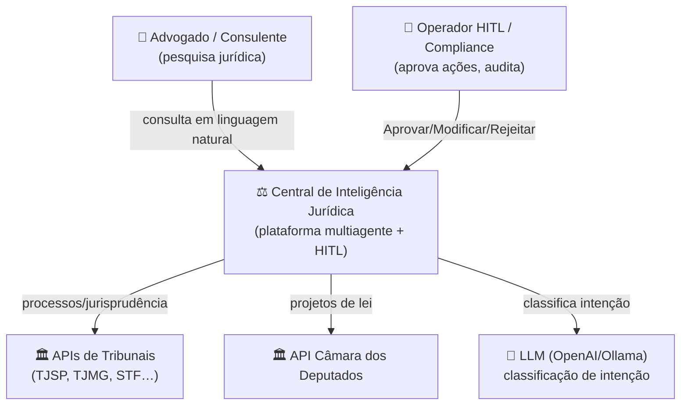
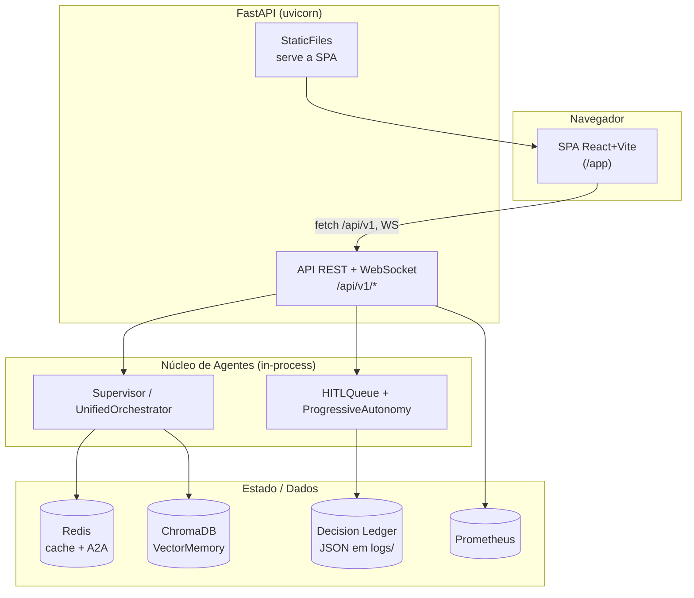
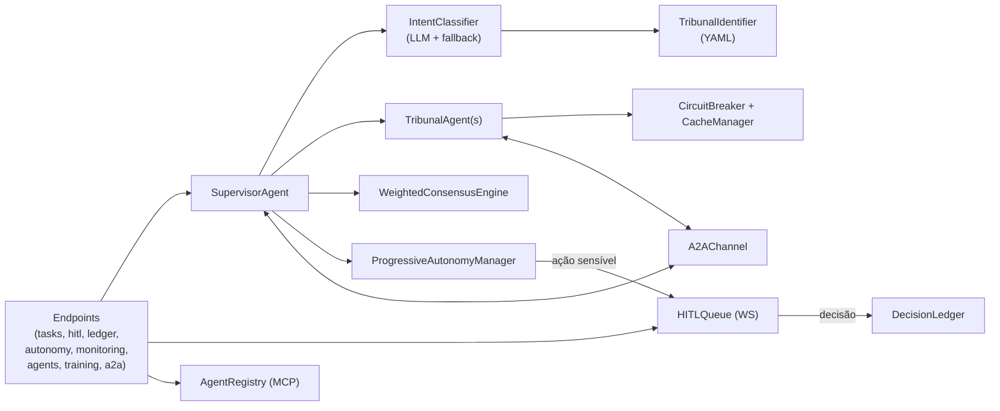
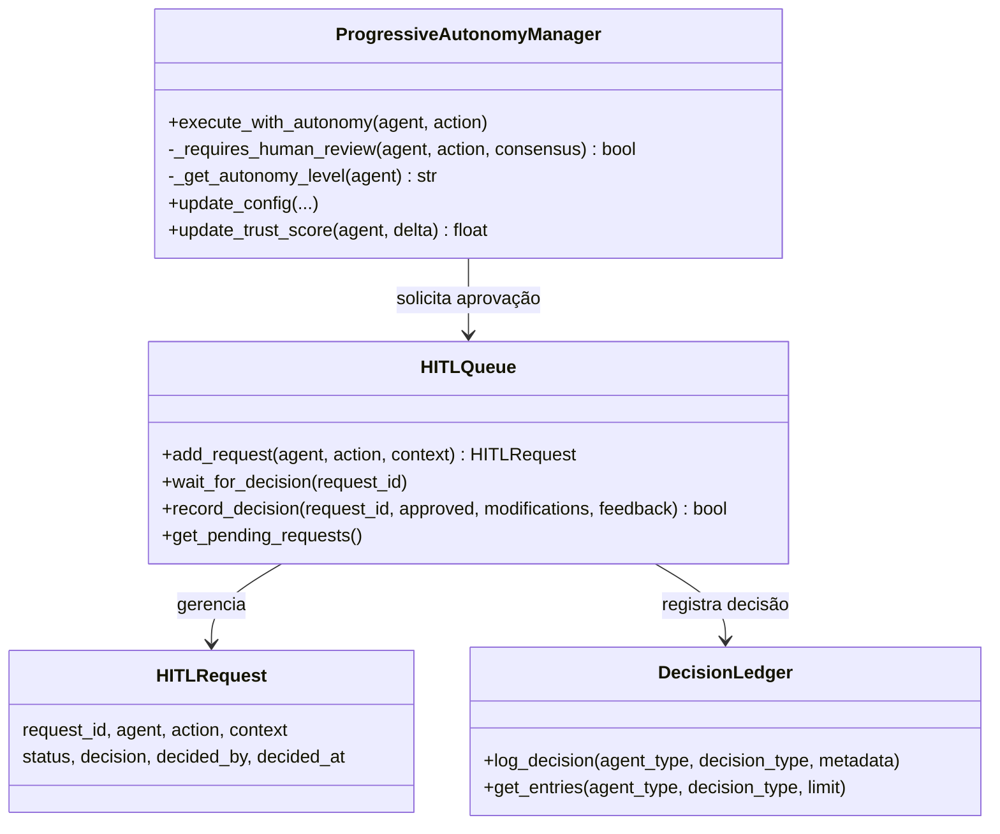
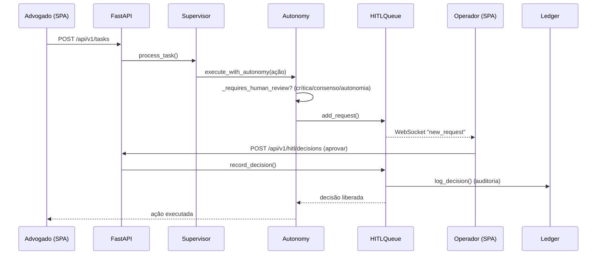
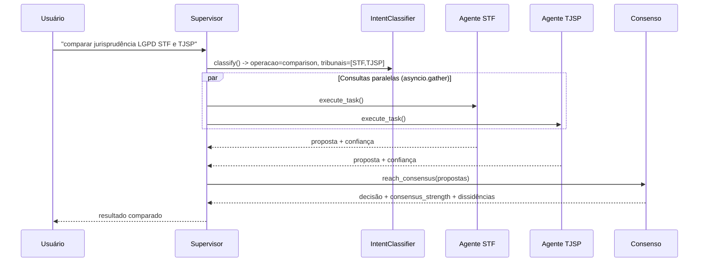

# Arquitetura (C4 + 4+1) — Central de Inteligência Jurídica

Documentação arquitetural nos quatro níveis do modelo **C4** (Contexto,
Contêiner, Componente, Código) mais diagramas de **sequência** dos cenários-chave
(visão 4+1). Os diagramas usam Mermaid (renderizam no GitHub).

> Visão de alto nível e tabela de componentes: [`../ARCHITECTURE.md`](../ARCHITECTURE.md).

---

## Nível 1 — Contexto

Quem usa o sistema e com quais sistemas externos ele conversa.

---

## Nível 2 — Contêineres

Unidades executáveis/implantáveis e seus armazenamentos.

> **Nota:** Redis e ChromaDB são opcionais — há fallback in-memory (A2A/cache) e o
> VectorMemory degrada graciosamente sem ChromaDB.

---

## Nível 3 — Componentes (API + núcleo de processamento)

---

## Nível 4 — Código (subsistema de decisão HITL)

---

## 4+1 — Cenário A: consulta com revisão humana (HITL)

## 4+1 — Cenário B: jurisprudência multi-tribunal (consenso)

---

## Referências de código

| Elemento | Arquivo |
|---|---|
| Endpoints | `src/api/main.py`, `src/api/{hitl,training,ledger,autonomy,monitoring}_endpoints.py` |
| Supervisor / Tribunal | `src/agents/{supervisor,tribunal}_agent.py` |
| Intenção / Roteamento | `src/routing/{intent_classifier,tribunal_identifier,learning_router}.py` |
| Consenso | `src/consensus/weighted_voting.py` |
| HITL / Autonomia | `src/hitl/{hitl_queue,progressive_autonomy}.py` |
| Auditoria | `src/utils/ledger.py` |
| Resiliência | `src/tools/circuit_breaker.py`, `src/utils/cache_manager.py` |
| MCP / A2A | `src/protocols/{agent_card,a2a_channel}.py` |
| Frontend | `frontend/` (build em `src/api/static/spa`) |
